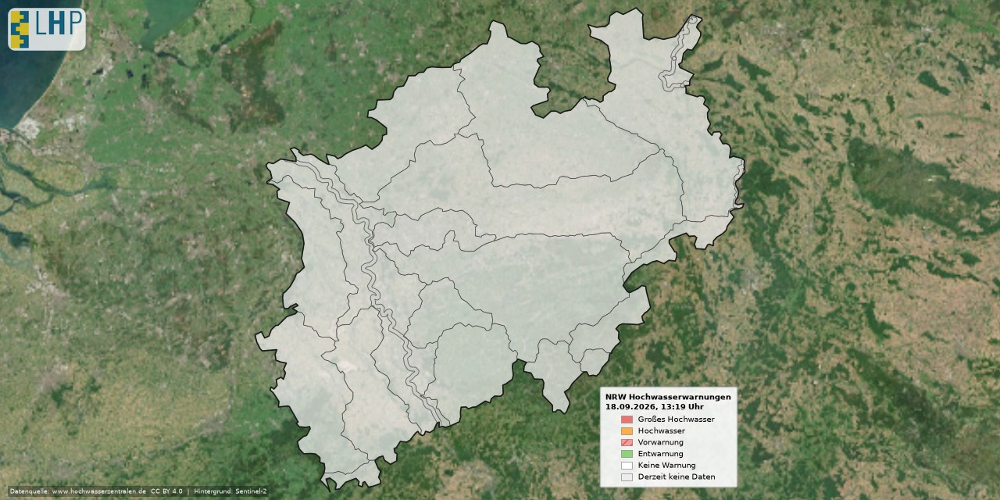

# NRW Hochwasser-Warnkarte

Automatisch generierte Karte der aktuellen Hochwasserwarnungen für Nordrhein-Westfalen, basierend auf Daten des [Länderübergreifenden Hochwasserportals (LHP)](https://www.hochwasserzentralen.de).



---

## Inhalt

```
.
├── generate_map.py                    # Hauptskript – Kartenerzeugung
├── Warngebiete-Polygon-NW.geojson     # Warngebiet-Polygone (Regionen)
├── Warngebiete-Polyline-NW.geojson    # Warngebiet-Linien (Flussabschnitte)
├── background.tiff                    # Sentinel-2 Hintergrundbild (EPSG:3857)
├── requirements.txt                   # Python-Abhängigkeiten
├── .github/
│   └── workflows/
│       └── generate_map.yml           # GitHub Actions – Ausführung alle 20 Min.
└── flood-warning-map-nrw-today.jpg    # Ausgabebild (wird automatisch aktualisiert)
```

---

## Funktionsweise

1. **Datenabruf** – Das Skript ruft alle 20 Minuten die aktuellen Warnungen für NRW über die LHP PublicAPI ab:
   ```
   GET https://api.hochwasserzentralen.de/data/alerts?state=NW
   ```
2. **Farbzuordnung** – Jedes Warngebiet (Polygon oder Flussabschnitt) erhält die passende Warnstufen-Farbe.
3. **Kartenrendering** – Die eingefärbten Gebiete werden auf ein Sentinel-2-Satellitenbild gelegt und als JPG gespeichert.
4. **Commit** – GitHub Actions committet das neue Bild automatisch in den `main`-Branch.

---

## Warnstufen und Farben

| Stufe                    | Farbe        | Hex-Code  | Darstellung         |
|--------------------------|--------------|-----------|---------------------|
| Sehr großes Hochwasser   | Violett      | `#9e8db9` | Fläche              |
| Großes Hochwasser        | Rot          | `#ec7370` | Fläche              |
| Hochwasser               | Orange       | `#fcae4b` | Fläche              |
| Vorwarnung               | Rosa         | `#f29d9b` | Fläche + Schraffur  |
| Entwarnung               | Grün         | `#8fd279` | Fläche              |
| Keine Warnung            | Weiß         | `#ffffff` | Fläche              |
| Derzeit keine Daten      | Hellgrau     | `#ededed` | Fläche              |

---

## Einrichtung

### Voraussetzungen

- Python 3.11 oder neuer
- `pip install -r requirements.txt`
- Die System-Bibliothek **libcairo2** ist für `cairosvg` (Logo-Rendering) erforderlich:

  ```bash
  # Debian / Ubuntu
  sudo apt-get install libcairo2-dev

  # macOS
  brew install cairo
  ```

### Lokale Ausführung

```bash
# Repository klonen
git clone https://github.com/DEIN-NUTZER/DEIN-REPO.git
cd DEIN-REPO

# Abhängigkeiten installieren
pip install -r requirements.txt

# Karte erzeugen
python generate_map.py
```

Das Ausgabebild wird als `flood-warning-map-nrw-today.jpg` im aktuellen Verzeichnis gespeichert.

---

## GitHub Actions – Automatischer Betrieb

Die Datei `.github/workflows/generate_map.yml` startet den Prozess **alle 20 Minuten** automatisch.  
Der Workflow:

1. Checkt den Repository-Inhalt aus
2. Installiert Python und alle Abhängigkeiten
3. Führt `generate_map.py` aus
4. Committet das aktualisierte JPG zurück in den `main`-Branch

Das Bild im README wird dadurch stets aktuell gehalten.

> **Hinweis:** GitHub Actions führt Cron-Trigger bei hoher Last nicht exakt auf die Minute aus. Leichte Verschiebungen (±5 Min.) sind normal.

---

## Datenquellen und Lizenzen

| Quelle | Lizenz |
|--------|--------|
| [LHP – Länderübergreifendes Hochwasserportal](https://www.hochwasserzentralen.de) | [CC BY 4.0](https://creativecommons.org/licenses/by/4.0/deed.de) |
| Sentinel-2 Satellitenbild (`background.tiff`) | [Copernicus Open Access](https://www.copernicus.eu/de/ueber-copernicus/datenzugang) |
| Warngebiet-Geometrien (LHP / LANUV NRW) | Behördliche Bereitstellung |

**CC BY 4.0 Pflicht:** Datenquelle (`www.hochwasserzentralen.de`) und Zeitpunkt der Datenbereitstellung (`Stand: TT.MM.JJJJ hh:mm`) müssen gut sichtbar angegeben werden. In Online-Medien ist die Datenquelle als klickbarer Link auszuführen. Beides ist im Ausgabebild bereits eingebettet.

---

## Verwandtes Projekt

Dieses Projekt ist analog zum [NRW Hitzewarnkarten-Projekt](https://github.com/umweltinformationssysteme/dwd_heat-health-warning-map_nrw) aufgebaut, das DWD-Hitzewarnungen visualisiert.
